# About

An MVP data processing system which collects data (metrics) from a source (laptop) and sends it through a data pipeline for processing and storage before analysing it against user-defined rules which generate alerts.

i.e. A very basic IT monitoring system.

# Goals

- Get hands-on with technologies I haven't used before.
- Learn about software architecture at a basic level.
- Learn the basic fundamentals of how an IT monitoring system works.

```mermaid
classDiagram

    %% RELATIONSHIPS
    Policy o-- IAction
    MetricDataPoint --|> ITelemetryDataPoint
    LogDataPoint --|> ITelemetryDataPoint
    IRawDataPoint ..|> ITelemetryDataPoint
    ITelemetryDataPoint *-- IMessageField
    PolicyEngine o-- Policy
    PolicyEngine o-- ITelemetryDataPoint
    MacOSMetricDataPoint --|> MetricDataPoint
    MacOsAgentDataParser --|> IDataParser
    MacOsAgentDataParser ..> MacOSMetricDataPoint
    IDataParser ..> ITelemetryDataPoint

    %% NOTES
    note for MacOSMetricDataPoint "Concrete class implements\nlog parsing & normalisation logic."


    class Policy{
        +Name : string
        +Description : string
        +Conditions : Condition[]
        +Actions : IAction[]
        +CreatedBy : User
        +CreatedAt : DateTime
        +Evaluate(dataPoint : ITelemetryDataPoint) bool
    }
    class IAction{
        <<Interface>>
        +Name : string
        +Description : string
        +Trigger() void
    }
    namespace DataPoints{
        class IRawDataPoint{
            <<Interface>>
            +Content : string
        }
        class ITelemetryDataPoint{
            <<Interface>>
            +Id : string
            +Timestamp : DateTime
            +Message : MessageField~T~[]
            +Source : string
            +ParseRawDataPoint(rawDataPoint : IRawDataPoint) ITelemetryDataPoint
            +ITelemetryDataPoint(rawDataPoint : IRawDataPoint)
        }
        class IMessageField~T~{
            <<Interface>>
            +Name : string
            +Value : T
        }
        class MetricDataPoint{
            +Id : string
            +Timestamp : DateTime
            +Message : IMessageField~double~[]
            +Source : string
            +ParseRawDataPoint(rawDataPoint : IRawDataPoint) ITelemetryDataPoint
            +ITelemetryDataPoint(rawDataPoint : IRawDataPoint)
        }
        class LogDataPoint{
            +Id : string
            +Timestamp : DateTime
            +Message : IMessageField~string~[]
            +Source : string
            +ParseRawDataPoint(rawDataPoint : IRawDataPoint) ITelemetryDataPoint
            +ITelemetryDataPoint(rawDataPoint : IRawDataPoint)
        }
        class MacOSMetricDataPoint{
            +Id : string
            +Timestamp : DateTime
            +Message : IMessageField~double~[]
            +Source : string
            +MacOSMetricDataPoint(rawDataPoint : IRawDataPoint)
            +ParseRawDataPoint(rawDataPoint : RawDataPoint)$ MacOSMetricDataPoint
        }
    }
    class PolicyEngine{
        +Policies : List~Policy~
        +DataToAnalyse : List~ITelemetryDataPoint~
        +LastDataPointAnalysedId : string
        +FetchDataToAnalyse() : void
        +ExecutePolicy(policy : Policy, dataPoint : ITelemetryDataPoint) bool
        +ClearDataToAnalyse() : void
    }
    namespace DataParsers{
        class IDataParser{
            <<Interface>>
            +Parse(rawDataPoint : IRawDataPoint) List~ITelemetryDataPoint~
        }
        class MacOsAgentDataParser{
            +Parse(rawDataPoint : IRawDataPoint) List~MacOSMetricDataPoint~
        }
    }
```

